# Library Membership Control System
** Made by Temirlan Karabaev

**Library Membership Control System**
The purpose of this program is to manage library memberships efficiently. It allows users to register, log in, and manage their accounts. Administrators have additional privileges, such as managing user accounts and viewing all registered users.

## Functionality of the Program
### General User Features:
- **Registration:** Users can register by providing their name, surname, phone number, age, and a secure password.
- **Login:** Users can log in using their unique ID and password.
- **Update Account Information:** Users can update their personal details, such as name, surname, phone number, age, and password.
- **Delete:** Users can delete their accounts,admins can delete another user accounts.
- **Export Account Data:** Users can export their account data to a JSON file, which is saved in the "Downloads" folder.
- **Import Account Data:** Users can import account data from a JSON file to add it to the system.

### Administrator Features:
- **Add New User:** Administrators can manually add new users to the system.
- **View All Users:** Administrators can view a list of all registered users.
- **Delete User:** Administrators can delete a user account from the system.

### Security Features:
- **Password Strength Validation:** Passwords must meet specific requirements:
  - At least 8 characters long.
  - Contain at least one digit (0-9).
  - Contain at least one uppercase letter (A-R).
  - Contain at least one special character (e.g., `!@#$%^&*()`).
- **Data Export/Import:** Account data is securely exported and imported in JSON format.

## Program Working Screenshots
### Menu
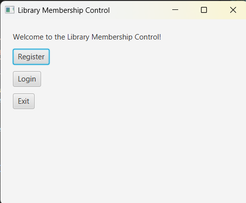
_________________________________________________________________________________________

### Login Form
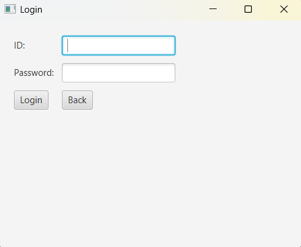

### Registration Form
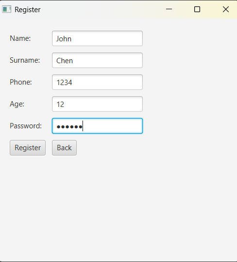

## Weak Passsword Notification
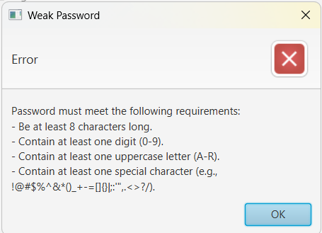

## Success Registration
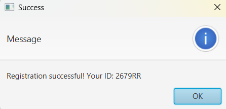

_________________________________________________________________________________________
### User Menu
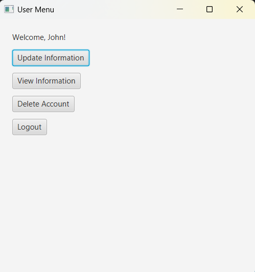
## Admin-User Menu
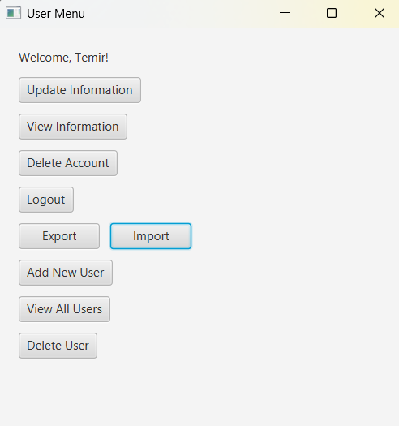

_________________________________________________________________________________________
### Functional

# Adding new member
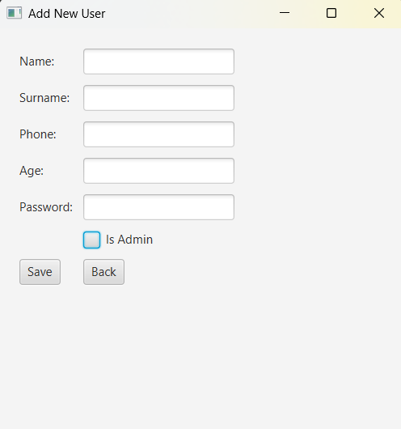
# View all members
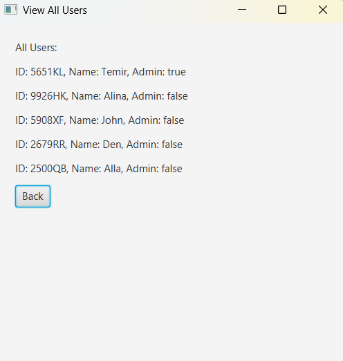
# User info
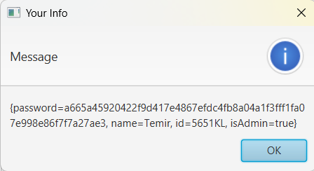
# Update user info
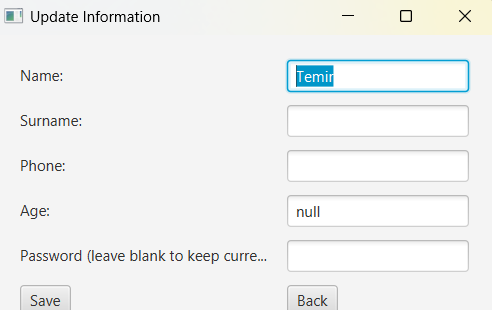
# Delete user by ID
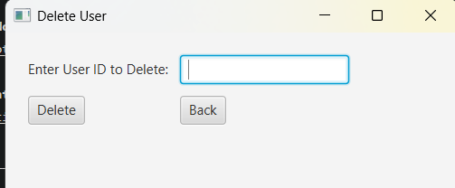

---

## How to Run
1. Clone the repository to your local machine.
2. Open the project in your preferred Java IDE (e.g., IntelliJ IDEA, Eclipse).
3. Run the `Main_UI` class to start the application.

## Requirements
- Java 8 or higher.
- JavaFX library.

